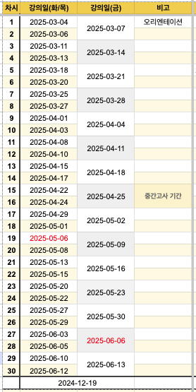

## 강의 개요

본 강좌는 논증적 글쓰기를 목표로 합니다.

- **강의명:** 대학글쓰기2
- **학기:** 2025년 1학기
- **강의 목표:** 논증적 글쓰기 능력 향상 훈련
- **운영 방식:** 이론 강의 + 실습 + 피드백(조별 및 교수자) + 기말논문 작성

## 강의 계획서 및 일정

강의는 **15주**간 **30차시**로 진행되며, 주요 일정은 다음과 같습니다:

- **1주차:** 오리엔테이션, 논증적 글쓰기에 대한 이론적 이해, 1차 조편성
- **2~7주차:** 논증적 글쓰기 개념 학습 및 실습
  - 2주차: 요약 연습 1
  - 3주차: 논제 및 논증 구성 연습
  - 4주차: 쟁점 및 딜레마 찾기
  - 5주차: 요약 연습 2
  - 6주차: 리서치 실습
  - 7주차: 기말논문 주제 선정(4개 주제, 주제별 조편성)
- **8주차:** 기말논문 리서치 시작 및 2차 조편성(중간고사 기간)
- **9~15주차:** 리서치 기반 논문 작성 연습(심화)
  - 11-12주차: 초고 작성 주간
  - 13~15주차: 기말 논문 교수자 코멘트(논증) 및 최종 제출

{: .img-fluid }

## 세부 계획은 2차시에 제공

## 그룹 논의를 중심으로 진행
- 2주차부터 1차 조편성
- 8주차부터 2차 조편성
- 특별한 사유로 회피하고자 하는 조원이 있는 경우, 조 구성 전 교수자 이메일로 요청.

## 과제 제출 및 강의 자료 접근 방법

과제 제출은 **ETL**의 지정된 과제함에서 **Markdown 서식**을 다운받아 `지정된파일명형식준수.md` 파일 형식으로 업로드해야 합니다.

[서울대학교 eTL 바로가기](https://etl.snu.ac.kr){: .btn .btn-primary .fs-5 .mb-4 .mb-md-0 .mr-2 }

강의자료는 본 홈페이지에서 확인할 수 있습니다.

## 결석 및 공결 처리

- [결석 및 공결 처리](/attendance.md)

## **1. 질문 방법**  
  
- 되도록 **수업시간 내 질문하고, 강좌 종료 후 쉬는 시간에는 질문을 자제**합니다.  
- 과제 관련 질문을 포함한 일반적인 질문은 **eTL > 게시판 > Q&A 게시판**을 이용합니다.
- 자신의 과제 및 글쓰기 관련 질문은 **다른 학생들도 궁금해할 가능성이 높으므로, 공개된 게시판에서 질문하는 것이 바람직합니다.**  
- 수업 종료 후 쉬는 시간에 질문하는 경우가 많으나, 이는 교수자의 **다음 강의 준비 및 일정 수행에 어려움을 줄 수 있습니다.**  

---

## **2. 과제 작성 및 제출 방법**  
- **구글 공유 폴더**에서 자신에게 배정된 양식을 사용하여 **실시간으로 작성**합니다.  
- 최종본은 **eTL의 과제제출함에 요구된 양식에 맞춰 제출 기한 내에 업로드**해야 합니다.  

---

## **3. 과제 마감시간**  
- 모든 과제의 마감시간은 **별도의 협의나 공지가 없는 경우 공지된 마감일의 23:00**입니다.  

---

## **4. 기타 사항**  
- 과제 제출 및 질문 관련 변동 사항이 있을 경우, 별도로 공지할 예정입니다.  
- 질문과 과제 제출 관련하여 추가 문의가 있을 경우, **eTL Q&A 게시판을 우선적으로 활용**하고, 필요한 경우 조교에게 이메일로 문의할 수 있습니다.  

> 강의자료 사이트 및 ETL 내 자료는 지속적으로 업데이트됩니다.

### 수업조교 연락처

- 최정화: jacqueline89@snu.ac.kr  
- 김보슬: kimboseul@snu.ac.kr

### 교수자 연락처

- 손제연: ricardo@snu.ac.kr